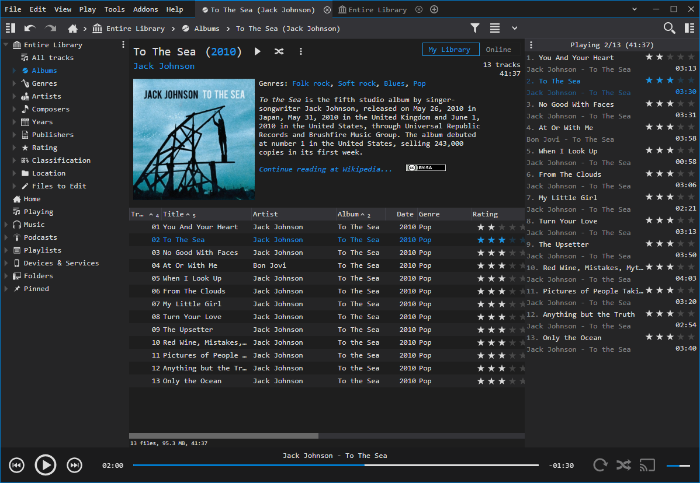

# Code Monkey Skin for MediaMonkey
A dark skin for MediaMonkey 5 inspired by the color theme of Visual Studio.

## Installation
Download the latest release from the releases section and double click the downloaded mmip file. A MediaMonkey dialog will automatically pop up, prompting you to confirm the installation.