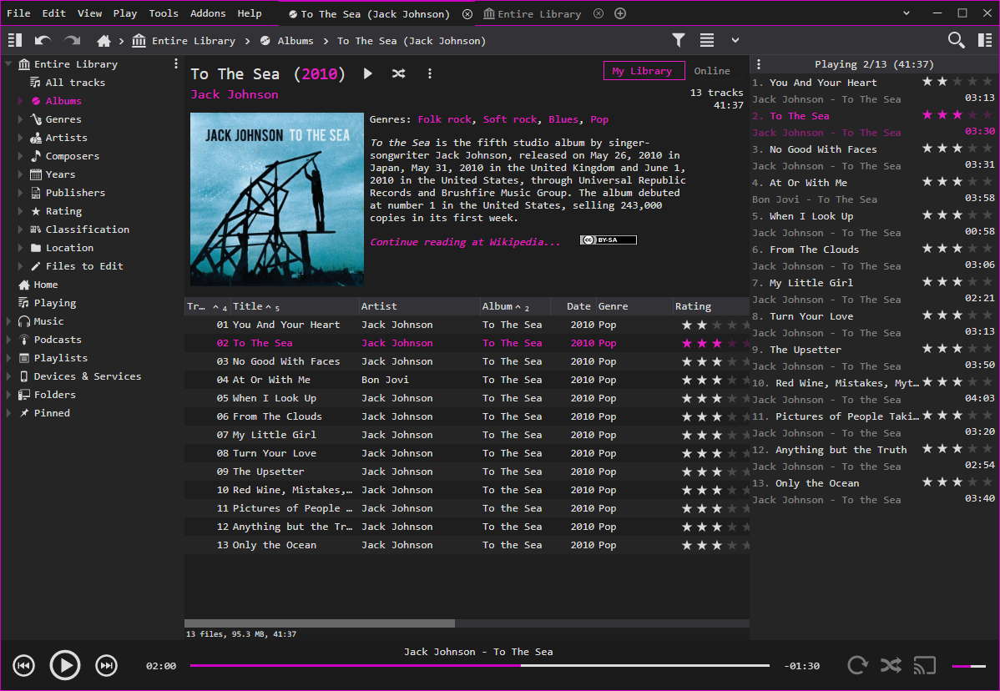
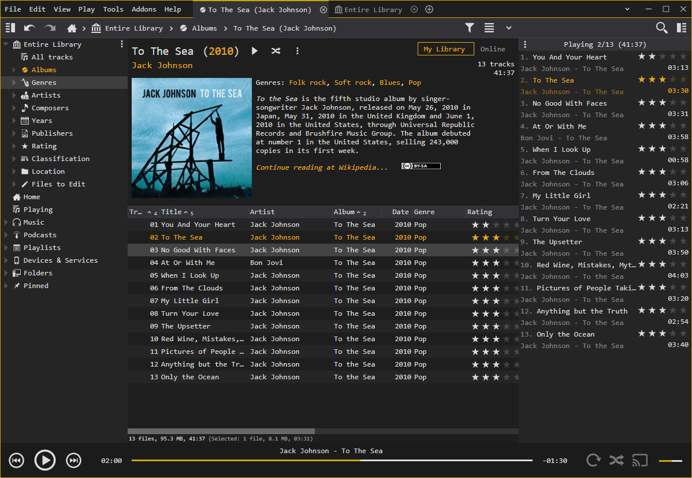
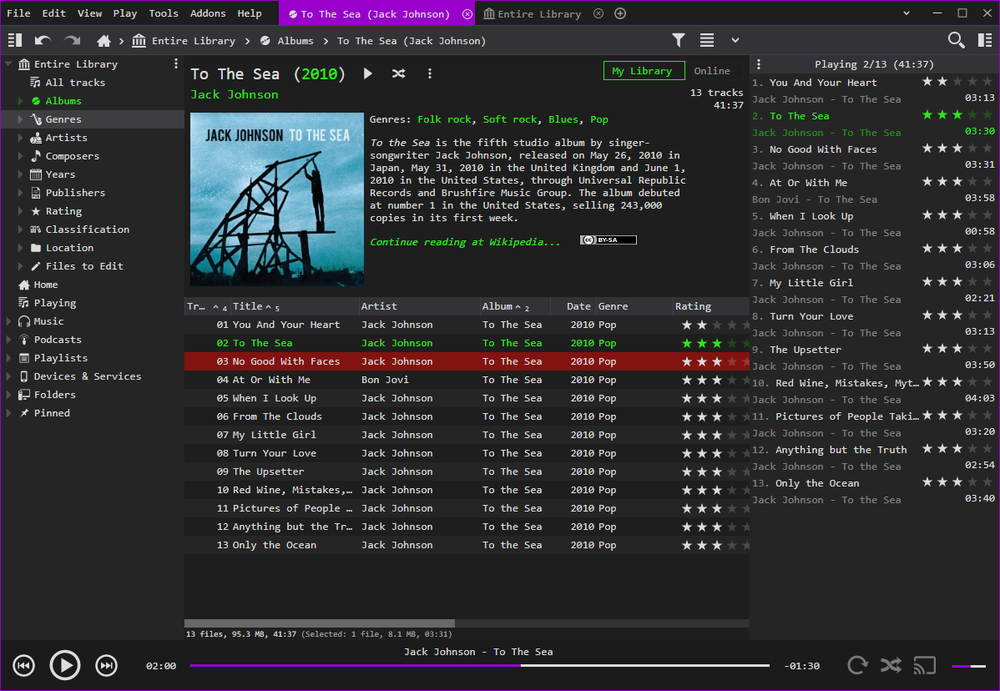

# Code Monkey Skin for MediaMonkey
A dark skin for MediaMonkey 5 inspired by the color theme of Visual Studio.


## Installation
Download the latest release from the releases section and double click the downloaded mmip file. A MediaMonkey dialog will automatically pop up, prompting you to confirm the installation.

## Customization
### Skin colors
The skin can be customized by configuring user-defined highlight and selection colors. To do so, open the options menu and navigate to the Layout > Skin section. Pick Code Monkey from the list of available skins, and select custom colors for each of the available options.

<p float="left">
  
   
   
</p>
<p float="left">
   
   
</p>

### Font
There is no built-in method to change the font used by the skin. This is a deliberate decision as it is designed to look a certain way, and the font has a major impact on that. It is, however, relatively easy to modify the skin to change the font used.

```
Please note that, while easily doable, changing the font used by Monkey Code is not generally recommended or supported.
```

- Install Code Monkey as ususal and exit mediamonkey
- Navigate to the `CodeMonkey` folder in your mediamonkey settings directory, usually located in `%appdata%/MediaMonkey5/Skins`
- Open `skin_base_add.less` located in the `skin` subfolder with a text editor
- Add a new @font-face block below the existing ones, roughly in the middle of the file. Here is an example 
```css
/* if you want to use a locally installed font */
@font-face { 
    font-family: MyFont; 
    src: local('MyFont');
}


/* if you want to use a downloaded font */
@font-face { 
    font-family: 'MyFont'; 
    src: url("/skin/fonts/MyFont.ttf");
}
```
- Once you created the new font-face property, update the following properties to have these values:
```css
@selectedFontFamily: MyFont;
@fontWeight: normal;
@fontSpacing: 0;
@fontStretch: 100%;
```
-  The value of `@selectedFontFamily:` should match the value of the `font-family` property in the @font-face property you just created
- Save the file
- If you are using a downloaded font make sure to copy the ttf, otf, or woff file into the font `subfolder` below the skin folder you found the `skin_base_add.less` file in
- Start mediamonkey again

With this, mediamonkey should now use your own font.
